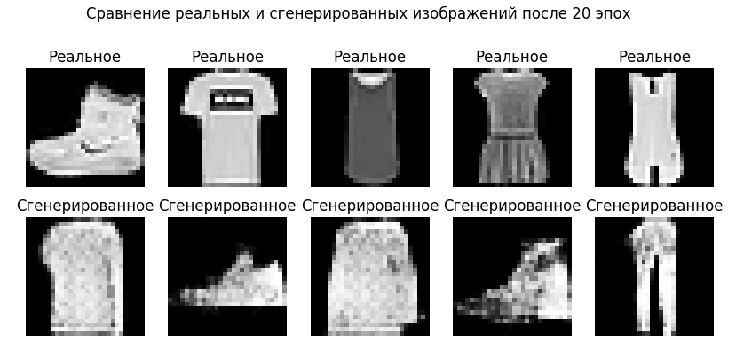

# GAN-MNIST-Exploration

## Обзор проекта

Этот репозиторий содержит **исследовательский Jupyter Notebook**, посвященный **Генеративно-состязательным сетям (Generative Adversarial Networks - GAN)**. Проект демонстрирует пошаговую реализацию базовой архитектуры GAN, обученной на датасете **Fashion MNIST** для генерации изображений различных предметов одежды.

Ноутбук подробно объясняет концепции GAN, их компоненты (Генератор и Дискриминатор), функции потерь и процесс обучения. Он предназначен для изучения принципов работы GAN и получения практического опыта в их создании и обучении.

## Ключевые особенности

* **Реализация GAN с нуля:** Построение архитектур Генератора и Дискриминатора с использованием Keras и TensorFlow.

* **Обучение на Fashion MNIST:** Использование датасета Fashion MNIST для демонстрации генерации изображений различных предметов одежды.

* **Визуализация процесса обучения:** Отслеживание потерь Генератора на протяжении эпох с помощью графика.

* **Генерация изображений:** Демонстрация способности обученной GAN генерировать новые образцы, похожие на данные из обучающей выборки.

* **Подробные пояснения:** Ноутбук включает текстовые блоки с объяснениями ключевых концепций и шагов реализации.

## Технологии

* Python

* TensorFlow / Keras

* NumPy

* Matplotlib

* Pillow

* Jupyter Notebook

## Примеры сгенерированных изображений



Данный проект является базовой реализацией GAN, созданной для изучения основных принципов работы. Я осознаю, что текущее качество генерируемых изображений не является идеальным и при более длительном обучении базовая архитектура может демонстрировать нестабильность генерации или "mode collapse" (схлопывание мод).

Для значительного улучшения качества, стабильности и контроля над процессом генерации, а также для повышения "продакшн-готовности" проекта, могут быть реализованы следующие шаги:

* Переход к Conditional GAN (CGAN): Реализация условного GAN позволит контролировать процесс генерации, указывая желаемый класс объекта (например, генерировать только рубашки или только ботинки). Это также поможет в борьбе с проблемой "mode collapse" и улучшит общее качество и разнообразие сгенерированных изображений.

* Использование продвинутых архитектур: Применение таких архитектур, как Deep Convolutional GAN (DCGAN), Wasserstein GAN (WGAN) или StyleGAN, может значительно улучшить стабильность обучения и детализацию генерируемых изображений.

* Оценка качества генерации: Добавление количественных метрик, таких как Inception Score (IS) или Fréchet Inception Distance (FID), для объективной оценки качества и разнообразия сгенерированных изображений.

## Установка и запуск

Для запуска этого Jupyter Notebook выполните следующие шаги:

1. **Клонируйте репозиторий:**

   ```bash
   git clone [https://github.com/YourUsername/GAN-MNIST-Exploration.git](https://github.com/YourUsername/GAN-MNIST-Exploration.git)
   cd GAN-MNIST-Exploration
   ```

2. **Создайте и активируйте виртуальное окружение (рекомендуется):**

    ```bash
    python -m venv venv
    # Для Windows:
    .\venv\Scripts\activate
    # Для macOS/Linux:
    source venv/bin/activate
    ```

3. Установите зависимости:

    * Установите Jupyter Notebook: <pip install jupyter>
    * Установите остальные зависимости, перечисленные в <requirements.txt>:
    ```bash
    pip install -r requirements.txt
    ```

4. Запустите Jupyter Notebook:

    ```bash
    jupyter notebook
    ```

5. Откройте и запустите <gan_mnist_exploration.ipynb> в браузере.